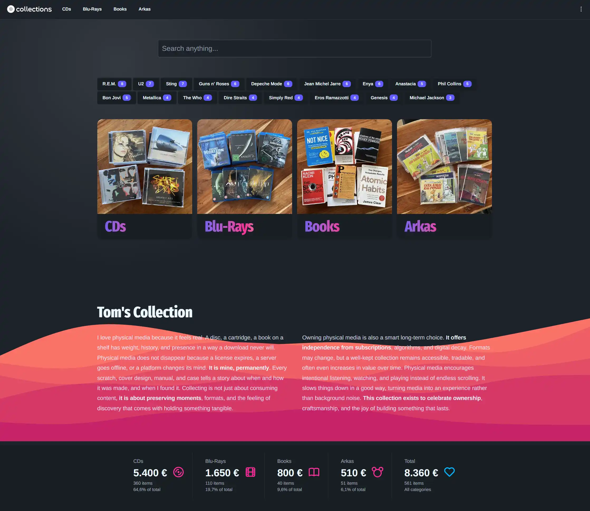

# Collections 2

A lightweight personal media catalog built with CodeIgniter 4.

Collections 2 imports HTML table exports from Obsidian, stores them in MySQL, and serves fast searchable views for CDs, books, Blu-rays, and Arkas issues.



## Features

- Fast homepage and media page caching.
- AJAX search across creator/title with highlighted matches.
- Automatic import trigger from the `About` page when source files change.
- Responsive UI using Tailwind CSS + daisyUI.
- Simple content workflow: maintain data in Obsidian, export HTML, upload, done.

## Stack

- PHP `^8.2`
- CodeIgniter `^4.7`
- MySQL (default driver: `MySQLi`)
- Tailwind CSS v4
- daisyUI
- esbuild

## Project Structure

- `app/Controllers/Home.php`: homepage, media pages, about page.
- `app/Controllers/Ajax.php`: AJAX endpoints (search).
- `app/Models/ContentModel.php`: media queries and stats helpers.
- `app/Models/AjaxModel.php`: search query model.
- `app/Models/ImportModel.php`: import pipeline from Obsidian HTML files.
- `app/Views/`: page templates and partials.
- `public/js/src/`: frontend JS source files.
- `tailwind/`: Tailwind input and utility layers.
- `writable/obsidian_html/`: import source folder + manifest tracking.

## Routes

- `GET /` -> homepage
- `GET /media/{alias}` -> media list by type
- `GET /about` -> story page + import trigger
- `GET /ajax/search?q=...` -> JSON search results (AJAX only)

## Quick Start

### 1. Install dependencies

```bash
composer install
npm install
```

### 2. Configure environment

Copy `env` to `.env` if needed, then set at least:

```ini
CI_ENVIRONMENT = development

database.default.hostname = localhost
database.default.database = collections
database.default.username = root
database.default.password =
database.default.DBDriver = MySQLi
database.default.port = 3306
```

For local development without caching:

```ini
cache.handler = dummy
```

For production, use file/redis/etc:

```ini
cache.handler = file
```

### 3. Prepare database

This repository currently does not include migrations, so create tables manually.

Minimum required columns:

- `media`
  - `id` (PK)
  - `media_type_id` (int)
  - `title` (string)
  - `creator` (string, nullable/empty allowed)
  - `collection` (string, nullable/empty allowed)
- `media_types`
  - `id` (PK)
  - `media_type` (string label)
  - `alias` (route alias, e.g. `cds`, `books`, `arkas`, `blu-rays`)
  - `position` (int, for menu ordering)
  - `item_msrp` (numeric)
  - `items_count` (int)
  - `total_msrp` (numeric)

Important:

- `media.media_type_id` must reference `media_types.id`.
- Footer and navigation depend on `media_types` records existing.

### 4. Build frontend assets

Development (watch mode):

```bash
npm run dev
```

Production build:

```bash
npm run build
```

### 5. Run application

CodeIgniter local server:

```bash
php spark serve
```

Or serve via Apache/Nginx with document root set to `public/`.

## Content Import Workflow

Collections 2 expects Obsidian HTML exports in:

- `writable/obsidian_html/`

Expected filenames:

- `cds-collection.html`
- `books-collection.html`
- `arkas-collection.html`
- `blu-ray-collection.html`

How it works:

1. Visit `/about`.
2. `ImportModel::initImport()` compares file mtimes against `writable/obsidian_html/manifest.json`.
3. If changed, importer parses the first table from each file.
4. `media` table is refreshed and repopulated.
5. Media type stats are recalculated and runtime cache/log/session artifacts are cleaned.

## Caching

Current behavior:

- `Home::index()` caches rendered homepage output (`page-home`).
- `Home::media()` caches rendered media pages (`page-media-{alias}-p{page}`).
- `Home::about()` is not cached.

Recommended setup:

- Development: `cache.handler = dummy`
- Production: `cache.handler = file` (or Redis/Memcached if configured)

## Search API

Endpoint:

- `GET /ajax/search?q=term`

Behavior:

- Requires AJAX header (`X-Requested-With: XMLHttpRequest`).
- Ignores terms shorter than 2 characters.
- Searches `creator` and `title`.
- Returns up to 15 rows with `creator`, `title`, `collection`, `type`.

## Scripts

- `npm run dev`: run CSS and JS watchers in parallel.
- `npm run build`: build minified CSS and JS bundles.
- `composer test`: run PHPUnit test suite.

## Notes

- `mediaTypes` is preloaded globally in `BaseController` for navigation/footer rendering.
- Version display uses `SYS_VERSION` and is shown in footer.
- Public assets are versioned in layout with `?v=SYS_VERSION`.

## License

MIT
